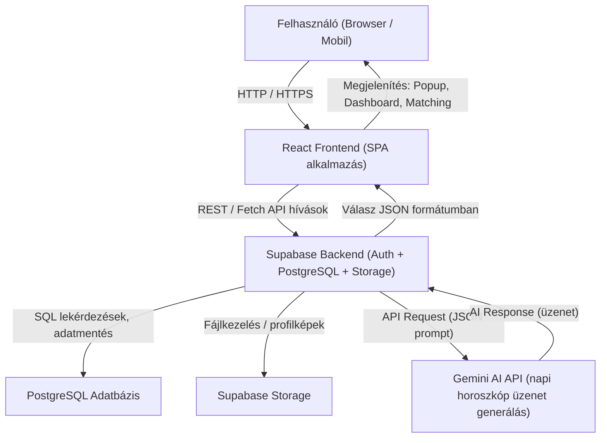

# SoulMates Application Rendszerterv

## 1. Rendszer célja

### 1.1 Hatékonyság növelése
A rendszer célja, hogy az asztrológiai tartalmak előállítását és
felhasználását **automatizálja** mesterséges intelligencia segítségével.
Az AI-modul képes napi horoszkópokat, személyre szabott üzeneteket és
hangulatelemzéseket generálni, ezáltal csökkentve az emberi beavatkozás
szükségességét és növelve a tartalomfrissítés sebességét.

### 1.2 Adminisztratív terhek csökkentése
A felhasználói adatok, profilok és naplóbejegyzések automatikusan
feldolgozásra kerülnek a háttérrendszerben (Supabase + Node.js).
Ezáltal az adminisztrátorok munkaterhe jelentősen csökken, hiszen a
rendszer önállóan végzi az adatkezelést, jelentéskészítést és az
engagement-statisztikák generálását.

### 1.3 Felhasználói élmény
A felhasználói élmény középpontjában a **gyors, intuitív és vizuálisan
vonzó felület** áll. A cél, hogy az alkalmazás minden nap interaktív,
motiváló élményt nyújtson, amely az asztrológiát modern, játékos formában
prezentálja. A Framer Motion animációk és a kaparós napi üzenetek
különleges UX-élményt biztosítanak.

### 1.4 Funkcionális scope
A projekt keretében megvalósítandó fő funkciók:
- Felhasználói regisztráció és zodiákus profil generálása  
- Napi horoszkóp generálása mesterséges intelligenciával  
- Hangulat- és szokásnapló funkció  
- Interaktív napi üzenet megjelenítése (kaparós popup)  
- Közösségi modul és felhasználói ajánlások  
- Statisztikai dashboard és trendelemzés  

### 1.5 Nem célok
A projekt nem tartalmaz:
- Klasszikus társkereső funkciókat (match, chat alapú kapcsolatépítés)  
- Manuális horoszkópírást  
- Offline üzemmódot vagy többnyelvűséget az MVP fázisban  

### 1.6 Előnyök a dolgozók számára
A fejlesztők számára a projekt lehetőséget nyújt **AI-integrációs és
frontend animációs technológiák** kipróbálására. Az adminisztrátorok
automatizált riportokat kapnak, így kevesebb időt kell manuális
adatgyűjtéssel tölteniük.

### 1.7 Szervezeti előnyök
A szervezet számára a rendszer **piaci versenyelőnyt** biztosít azáltal,
hogy egy modern, trendkövető alkalmazást kínál, amely képes fiatal,
digitális közönséget megszólítani. Az automatizálás csökkenti a
működési költségeket, miközben növeli a felhasználói aktivitást.

---

## 2. Projekt terv

### 2.1 Projektszerepkörök és felelősségek
A projektben több szerepkör működik együtt annak érdekében, hogy a fejlesztés
hatékonyan és ütemezetten haladjon.  
A **projektvezető** feladata a csapat munkájának koordinálása, a fejlesztési
fázisok és mérföldkövek teljesülésének nyomon követése, valamint a
kommunikáció fenntartása a megrendelővel és a projekt tagjaival.  
A **fejlesztők** négyfős csapatot alkotnak, akik szorosan együttműködnek a
rendszer implementálásában, tesztelésében és a dokumentáció készítésében.  
A **UI/UX designer** felel a felhasználói felület megjelenéséért, a modern,
misztikus-futurista stílusért, valamint a reszponzív élmény biztosításáért
minden eszközön.  
A **tesztelők** feladata a funkcionális hibák azonosítása, a felhasználói
élmény validálása, valamint a végső átadás előtti minőségbiztosítás.

### 2.2 Projektmunkások és felelősségeik
A **backend fejlesztő** felelős az adatkezelési logika, az API-k és az üzleti
folyamatokat támogató backend-funkciók megvalósításáért.  
A **frontend fejlesztő** a reszponzív webes és mobil felület kialakítását
végzi, ügyelve az intuitív kezelhetőségre és a vizuális élményre.  
Az **adatbázis-felelős** tervezi és optimalizálja a logikai és fizikai
adatmodellt, biztosítva az adatintegritást, a normalizáltságot és a gyors
lekérdezéseket.  
A **dokumentáció-felelős** gondoskodik a rendszerterv és a fejlesztési
folyamatok egységes dokumentálásáról, valamint a verziókövetés (GitHub)
naprakészen tartásáról.  
A **projektvezető** irányítása alatt a csapat heti szinten egyeztet, és a
fejlesztés állapotát sprintjelentések formájában rögzíti.  
Minden csapattag felelős a saját modulja hibamentes működéséért és
integrációjáért a teljes rendszerbe.

### 2.3 Ütemterv

A projekt fejlesztési ütemterve heti bontásban az alábbiak szerint alakul:

| **Hét** | **Fázis** | **Feladatok és tevékenységek** |
|----------|------------|--------------------------------|
| **6. hét** | Követelményspecifikáció | A projekt céljainak, funkcióinak és elvárásainak meghatározása. KövSpec és FunkSpec dokumentumok elkészítése. |
| **7. hét** | Rendszerterv | A rendszer architektúrájának, adatmodelljeinek és technológiai stackjének kidolgozása. |
| **8. hét** | Fejlesztés – Sprint 1 | Alapstruktúra létrehozása (frontend és backend setup), adatbázis-kapcsolat és AI API integráció kezdeti implementálása. |
| **9. hét** | Fejlesztés – Sprint 2 | Funkcionális modulok fejlesztése: regisztráció, AI-napi üzenet generálás, mood/habit log funkció. |
| **10. hét** | Demó + Sprint 3 | A működő MVP verzió bemutatása. A demó során értékelés, visszajelzések gyűjtése és finomhangolás. |
| **11. hét** | Fejlesztés – Sprint 4 + Tesztelés | Modulok véglegesítése, hibajavítások és manuális tesztelés (fejenként 10–20 tesztlépés, jegyzőkönyvezve). |
| **12. hét** | Fejlesztés – Sprint 5 + Teszt dokumentáció | Tesztelés folytatása, tesztdokumentáció készítése, funkcionális hibák javítása. |
| **13. hét** | Átadás-átvétel | A végleges rendszer bemutatása, értékelés és dokumentáció leadása. Projektzárás. |

A fejlesztés során minden sprint végén **heti státuszmegbeszélés** történik,  
ahol a csapattagok értékelik a haladást és meghatározzák a következő hét prioritásait.

### 2.4 Mérföldkövek
- M1: Követelményspecifikáció és funkcionális terv elkészül  
- M2: MVP verzió működő AI-modullal  
- M3: Interaktív UI és statisztikai modul  
- M4: Tesztelés lezárása és végső átadás  

---

## 3. Üzleti folyamatok modellje

### 3.1 Üzleti szereplők
- **Felhasználó:** napi üzenetek fogadása, hangulatnapló vezetése  
- **Adminisztrátor:** rendszerfigyelés, tartalmi moderálás  
- **AI modul:** napi üzenet generálás és profiladatok feldolgozása  

### 3.2 Üzleti folyamatok
1. Felhasználó regisztrál → rendszer létrehozza AI-profilt  
2. Felhasználó naplózza hangulatát → AI értelmezi az adatokat  
3. AI generál személyre szabott napi üzenetet  
4. Rendszer megjeleníti interaktív formában (popup)  
5. Felhasználó visszajelzést ad → adatok elemzésre kerülnek  

### 3.3 Üzleti entitások
- **users** (id, name, birthDate, mood, habits)  
- **daily_message** (id, userId, date, messageText, sentiment)  
- **mood_logs** (id, userId, moodLevel, notes)  
- **matches** (zodiac, matchScore)  

Az entitások között relációk állnak fenn (pl. egy felhasználónak több
MoodLog-ja lehet), amelyek segítik az AI-t a személyre szabott
tartalomgenerálásban.

---

## 4. Fizikai környezet

- **Szerveroldal / Backend:**  
  - Supabase szolgáltatás: PostgreSQL adatbázis, Auth, Storage, Realtime  
  - Hosted cloud környezet (Supabase cloud)  
  - SSL titkosított kommunikáció minden adatátvitelhez  
  - Automatikus backup és snapshot naponta  
  - Hálózati redundancia: több adatközpont használata  

- **Kliensoldal / Frontend:**  
  - React SPA (Single Page Application) a felhasználói eszközön  
  - Reszponzív design: mobil, tablet, desktop  
  - Böngészőkövetelmények: Chrome, Firefox, Edge, Safari (legfrissebb két verzió)  
  - Offline cache: PWA manifest a gyors betöltéshez  

- **AI integráció:**  
  - Gemini AI vagy OpenAI GPT-5 mini API a napi üzenetek generálásához  
  - HTTPS alapú hívások backendről  
  - Cache a gyakori promptokhoz a gyors válaszidő érdekében  

- **Értesítési rendszer:**  
  - Firebase Cloud Messaging / OneSignal  
  - Push notification engedélyek kezelése a kliens oldalon  



---

## 5. Implementációs terv

### Frontend

- **Technológia:** React 18 + react-router-dom + Bootstrap 5  
- **Komponensek felépítése:**  
  - `/components` – újrafelhasználható UI elemek (gombok, popup, card)  
  - `/pages` – főoldal, dashboard, profil, chat  
  - `/hooks` – state kezelés, mood log, AI API hívások  
- **UI/UX irányelvek:**  
  - Modern, misztikus-futurista színek és tipográfia
    - css színek:

    ```css
        --primary-color: #780081;
        --bg-color: #110049;
        --secondary-color: #fec3f1;
        --font-color: #c1f0f6;
        --star-color: #36ffeb
        --gold-color: #ffbf00
    ```

  - Animációk Framer Motion-nal  
  - Kaparós popup az AI napi üzenethez  

- **Adatkezelés:**  
  - Supabase REST API hívások a profil, mood log és daily message kezeléséhez  
  - Realtime funkciók: chat és mood log frissítése  
  - Async/await és React state management (useState, useEffect, useReducer)  
- **Login:**
  - Vezetéknév, keresztév
  - Születési dátum, hely, idő (ha tudja, opcionális)
  - Nem (she/her; he/him, they/them)

Példa kép a login kinézetre:


### Backend

- **Technológia:** Supabase cloud + PostgreSQL  
- **Adatszerkezet:**  
  - `users`: felhasználói profiladatok  
  - `mood_logs`: hangulatnapló  
  - `daily_messages`: AI napi üzenetek  
  - `matches`: barát ajánlások  

- **Biztonság és jogosultság:**  
  - Supabase Auth + JWT tokenek  
  - Row-level security minden táblán  
  - HTTPS minden kliens-backend kommunikációhoz

### AI integráció

- Backend API hívások a napi üzenetekhez  
- Prompt sablonok és cache használat a válaszidő optimalizálására  
- AI üzenetek mentése Supabase `daily_messages` táblába  

### Értesítések

- Firebase Cloud Messaging vagy OneSignal integráció  
- Push értesítések napi üzenethez, új chat üzenetekhez, új match-hez  
- Felhasználói beállítások: engedélyezés / tiltás  

---

## 6. Funkcionális követelmények részletes leírása

- **Regisztráció / Onboarding:**  
  - Űrlap validáció: név, nem, születési dátum/idő/hely  
  - AI profil generálása Supabase triggerrel  

- **Zodiákus profil kalkuláció:**  
  - Napjegy, Holdjegy, Aszcendens  
  - Bolygóállások lekérése AstroPy vagy Swiss Ephemeris API segítségével  
  - JSON struktúrában tárolás  

- **Mood / Habit log:**  
  - Felhasználói input 1–5 skálán  
  - Mentés Supabase `mood_logs` táblába  
  - Esetleg Grafikon generálás: Chart.js vagy Recharts, időszak szerint szűrhető  

- **AI napi üzenet:**  
  - Backend API hívás minden aktív felhasználónak  
  - Rövid, személyre szabott üzenet  
  - Mentés Supabase `daily_messages` táblába  

- **Interaktív popup:**  
  - Kaparós vagy animált felfedés  
  - Framer Motion + react-scratchcard-js  

- **Felhasználói matching:**  
  - Algoritmus: csillagjegy kompatibilitás + hangulat + AI vibe score  
  - Ajánlások megjelenítése a frontend-en  
  - Elfogadás/elutasítás kezelése, kapcsolati fa frissítése  

- **Chat / közösségi funkció:**  
  - Supabase Realtime API  
  - Üzenetküldés, emoji reakciók  
  - Notifikáció érkezéskor  

- **Értesítések:**  
  - Push notification testreszabás a profilban  
  - Értesítési preferenciák mentése Supabase-ben  

- **Dashboard / statisztika:**  
  - Interaktív grafikonok hangulat- és AI trendekről  
  - AI szöveges kiértékelés  

---

### Biztonság és adatvédelem

- HTTPS minden kommunikációhoz  
- JWT token alapú session kezelés  
- Row-level security Supabase táblákban  
- Felhasználói adat törlés/export lehetőség  
- GDPR kompatibilitás  
- Adat anonimizálás 90 nap után (opcionális)  

---

### Teljesítmény és skálázhatóság

- Popup betöltés <1 mp  
- AI generálás <2–5 mp  
- Realtime chat és mood log frissítés <1 mp  
- Skálázható Supabase infrastruktúra akár 10k+ aktív felhasználóig  
- Lazy load komponensek a frontend teljesítmény optimalizálásához  

---
